# Install Pandas

```bash
$ pip3 install pandas
```

# Install IPython

```bash
$ pip3 install ipython
```

# Pandas in IPython

```python
IPython 7.2.0 -- An enhanced Interactive Python. Type '?' for help.

In [1]: import pandas                                                                                                                                        

In [2]: df1 = pandas.DataFrame([[2,4,6],[10,20,30]])                                                                                                         

In [3]: df1                                                                                                                                                  
Out[3]: 
    0   1   2
0   2   4   6
1  10  20  30

In [4]: df1 = pandas.DataFrame([[2,4,6],[10,20,30]], columns = ["Price", "Age", "Value"], index = ["First", "Second"])                                       

In [5]: df1                                                                                                                                                  
Out[5]: 
        Price  Age  Value
First       2    4      6
Second     10   20     30

In [6]: df2 = pandas.DataFrame([{"Name":"John"}, {"Name":"Jake"}])                                                                                     
In [7]: df2                                                                                                                                           
Out[7]: 
   Name
0  John
1  Jake

In [8]: df2 = pandas.DataFrame([{"Name":"John","Surname":"John"}, {"Name":"Jake"}])                                                                         

In [9]: df2  
                                                                                                                            
Out[9]: 
   Name Surname
0  John    John
1  Jake     NaN
```

## Methods on dataframes
```python
In [18]: type(df1)        
                                                            
Out[18]: pandas.core.frame.DataFrame

In [19]: dir(df1)
                                                                        
Out[19]: 
['Age',
 'Price',
 'T',
 'Value',
 '_AXIS_ALIASES',
 .....
 .....
 .....
 #LOTS OF METHODS
 ```

### mean()

```python
In [21]: df1.mean()                                                                                                                                          
Out[21]: 
Price     6.0
Age      12.0
Value    18.0
dtype: float64

In [22]: df1.mean().mean()                                                                                                                                   
Out[22]: 12.0
```

### Series

```python
In [23]: type(df1.mean())                                                                                                                                    
Out[23]: pandas.core.series.Series

In [24]: df1.Price                                                                                                                                           
Out[24]: 
First      2
Second    10
Name: Price, dtype: int64

In [25]: type(df1.Price)                                                                                                                                     
Out[25]: pandas.core.series.Series
```

# Jupyter Notebook

## Install

```bash
$ pip3 install jupityr
```

## Run server

##### Browse to folder where you want to create and save notebooks

```bash
$ jupyter notebook
```

## Command on cells

Command | Action
--- | ---
Enter | New line within cell
CTRL + Enter | Execute code from cells
ALT + Enter | Create new cell
SHIFT + Enter | Execute code from current cell and create new cell
ESC + dd | Delete cell
Click in cell   | Edit existing cell

## Web scraping

```python
from bs4 import BeautifulSoup
import requests

r = requests.get("https://en.wikipedia.org/wiki/Eagle")
print(r.content)

soup = BeautifulSoup(r.content)
print(soup.prettify)
```

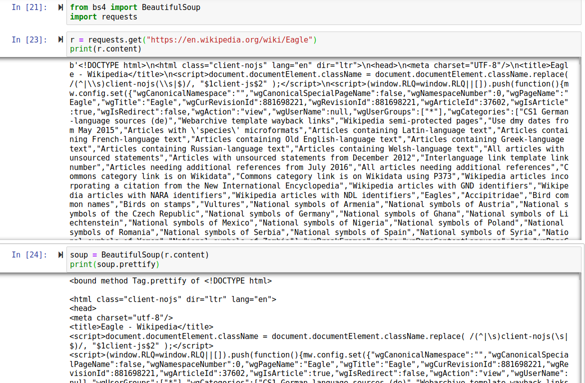

## CSV files

```python
import os
os.listdir()

import pandas
df1 = pandas.read_csv("supermarkets.csv")
df1
```

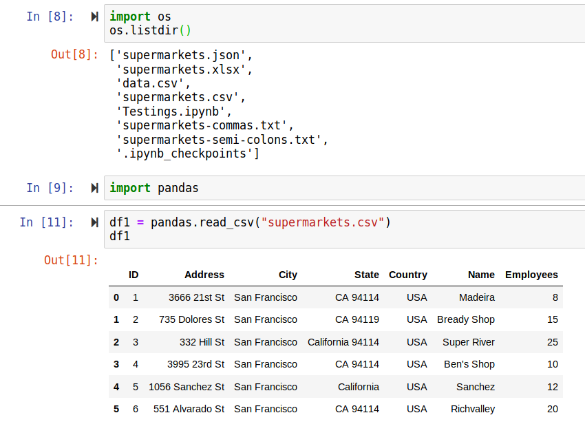

#### header = None

```python
df1 = pandas.read_csv("supermarkets.csv", header = None)
df1
```

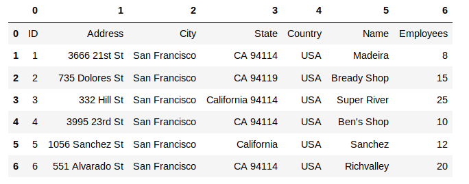

### Set index

##### Pandas will search the dtaframe for a column named "ID" and will set it as the index

```python
df1 = pandas.read_csv("supermarkets.csv")
df1.set_index("ID")
```

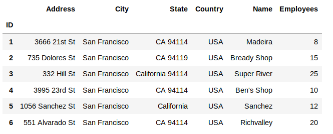

### Get shape of dataframe (rows, columns)

```python
df1.shape
```

## JSON files

```python
df2 = pandas.read_json("supermarkets.json")
df2.set_index("ID")
```

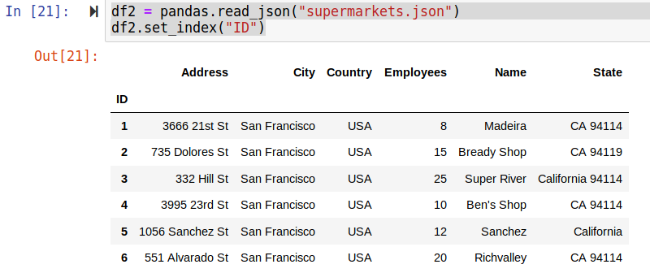

## Excel files

```python
df3 = pandas.read_excel("supermarkets.xlsx", sheetname = 0)
df3.set_index("ID")
```

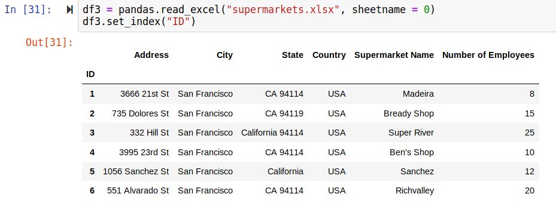

**Note:** Install xlrd module

```bash
pip3 install xlrd
```

## Structures Text files

### Commas

```python
df4 = pandas.read_csv("supermarkets-commas.txt")
df4
```

### Semi-colons

```python
df5 = pandas.read_csv("supermarkets-semi-colons.txt", sep=";")
df5
```

### From web

```python
df6 = pandas.read_csv("http://pythonhow.com/supermarkets.csv")
df6

df7 = pandas.read_json("http://pythonhow.com/supermarkets.json")
df7
```
## Get help

```python
pandas.DataFrame?
pandas.read_csv?
```

## Sort DataFrame values

```python
df6.sort_values(by='Employees', ascending=False)
```

## Set index

- Not an inplace operation
- Prints out new dataframe on the fly by does not store the change in the variable

```python
df7.set_index("Address")
```

#### To store the change
```python
df7 = df7.set_index("Address")
```

## Label based indexing - loc

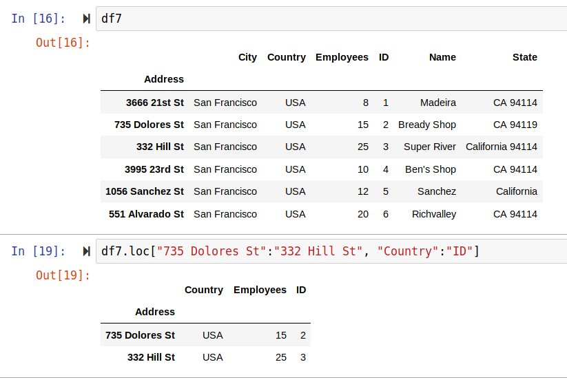

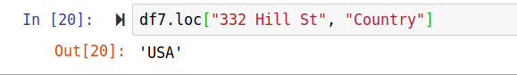

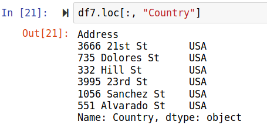

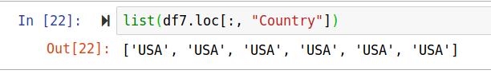

## Position based indexing - iloc

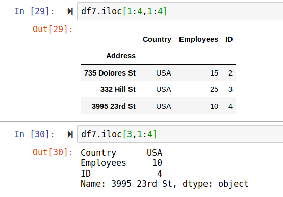

## Combined indexing - ix -- has been depreciated!

## Delete rows

### Not inline - assign to variable to save change

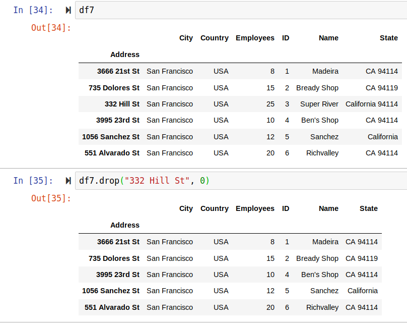

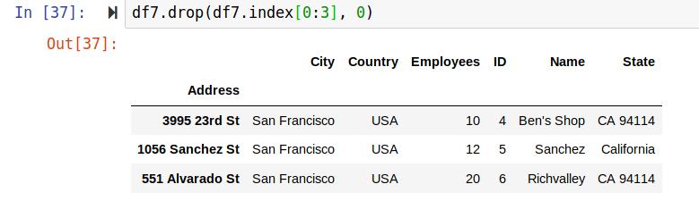

## Delete columns

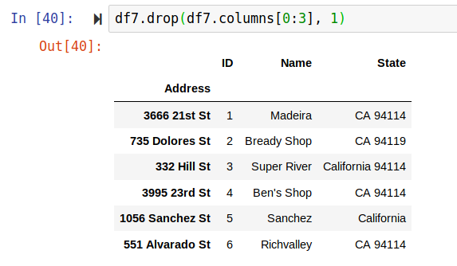
